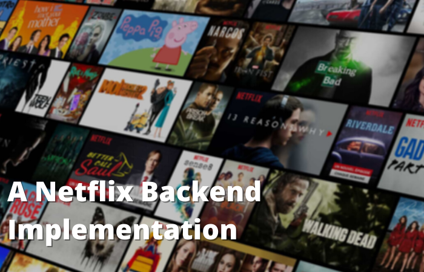
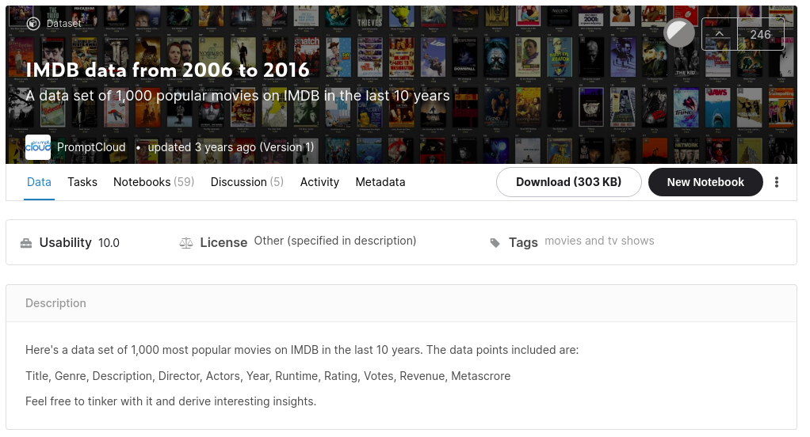
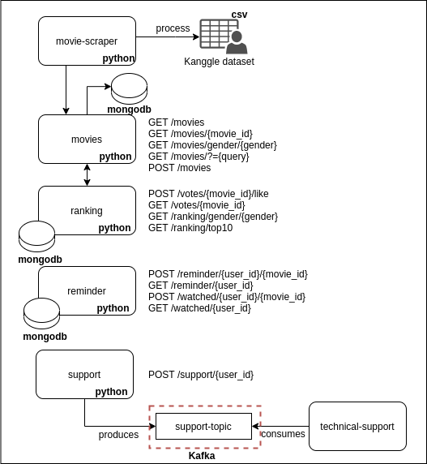
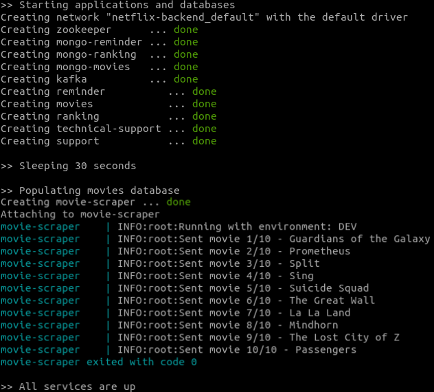
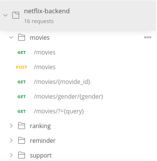

# A Netflix Backend Implementation

Here we implemented a sample of Netflix's backend. We had designed a Domain Driven Architecture using microservices and Kafka. In order to simulate a real scenario, we pick up a real dataset with 1,000 of the most popular movies on IMDB in the last 10 years.

**Keywords**: microservice, python, kafka, flask, restful-api

## Motivation

As an home work for my Master of Business Administration class in [Software Engineer](https://www.fiap.com.br/mba/mba-em-engenharia-de-software/) at [FIAP](https://www.fiap.com.br/), we decided to propose a backend implementation for Netflix. 

With this implementation we intend to provide APIs to:
- List movies by gender
- Visualize movie details
- Provide a vote option to like movies
- Provide a reminder list of movies
- Search movies by keyword
- List ranked movies by gender
- Open a technical support for problems
- List watched movies

## Dataset

In order to simulate a real scenario, we pick up from [Kaggle](https://www.kaggle.com/) an [IMDB dataset](https://www.kaggle.com/PromptCloudHQ/imdb-data) with 1,000 of the most popular movies on IMDB in the last 10 years. In this dataset are structured a lot of information about movies, however, to simplify our implementation we took only some of them.

We also designed a script to filter this dataset and build a populated database schema for our microservices.

## Architecture

Here we propose a domain driven architecture with microservices. In order to solve a non-functional requirement we implemented a [Kafka](https://kafka.apache.org/) communication between some services.

All microservices are coded with Python 3.7+, [Flask web framework](https://flask.palletsprojects.com/en/1.1.x/) and [Clean Architecture](https://blog.cleancoder.com/uncle-bob/2012/08/13/the-clean-architecture.html) priciples.

### Movies

The [movies](./movies) microservice take account of the movie domain. Their APIs answer questions about movie details, genders of movies and searchs for movies. Its database is built by the [movie scraper](./movie-scraper) which reads our IMDB dataset and populates the movies' database.

### Ranking

The [ranking](./ranking) microservice take account of the votes and movies ranking. Their APIs collect users likes and compute the ranking. 

### Reminder

The [reminder](./reminder) microservice collect the reminder and watch later movies list. Their APIs collect users desire for reminder a movie and to set movies as watched.

### Support

The [support](./support) microservice posts the user message to a Kafka topic in order to notify the _technical support_ team.

### Technical Support

The [technical support](./technical-support) reads from the _support-topic_ and logs a message simulating a service order creation.

### Movie Scraper

The [movie-scraper](./movie-scraper) process our dataset and build a populated database schema with all movies.

Here we use the [pandas](https://pandas.pydata.org/) library. This library reads our [dataset CSV file](./movie-scraper/resources/dataset/IMDB-Movie-Data.csv) and, given the _MAX_MOVIES_ variable, we add the movies to **movies** service.

## Running 

We provide a [bootstrap.sh](./bootstrap.sh) script to simplify the stack boot. This script runs our [docker-compose.yml](./docker-compose.yml) which starts all services, databases and Kafka. After that, the scripts sleeps for 30 seconds waiting for all container be up. So it runs the [docker-compose-scraper.yml](docker-compose-scraper.yml) which starts to populate our **movies** database. 

It's possible to customize the amount of movies changing the _MAX_MOVIES_ variable at [docker-compose-scraper.yml](docker-compose-scraper.yml). However we have, because of our dataset, we are limited to a max of 1,000 movies. Here we setup as default 10 movies. 

## Testing

As a simple way to test our stack, we provides a [postman collection](netflix-backend.postman_collection.json). This collection has sample requests for all proposed APIs.

